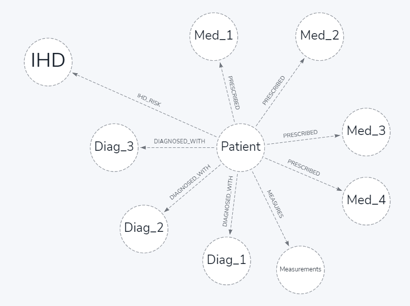

# medical-gds-sandbox
Repo for a use case submitted by a prospect for ML on Medical

## Load data
* You can use the csv files, put them into the import/ directory of your database and use the cypher scripts ion cypher/
* You can also use the Loading_data.ipynb notebook to load the data using Python
There are two datasets, 20 and 2000 patients. You can use Generator to get more datasets on the same pattern.

## Initial use case
Based on connections of each patient, determine if the patient should be linked to IHD
We got a constant 0.5 probability for each new patient using Link Prediction
Tried several ways in these notebooks.
{width=40%}
